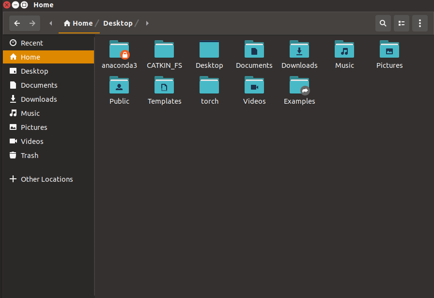
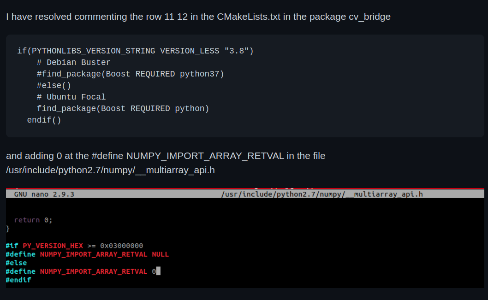

# object_detection-
Repo for object detection/localization in ROS with Intel Realsense camera


# Setup 

## Requirements 

### 1) Install ROS melodic 
- Follow the guide [here](http://wiki.ros.org/melodic/Installation/Ubuntu) to install ROS melodic 
- paste this into the terminal to install catkin build tools : 

```console 
sudo apt-get install python-catkin-tools
```

### 2) Install Torch (used to run neural network inference) 

- Go to the Nvidia Website [here](https://forums.developer.nvidia.com/t/pytorch-for-jetson-version-1-8-0-now-available/72048) and 
download the ```PyTorch v1.8.0``` .whl file 
- extract the folder in the home directory and rename it to ```torch``` (so the compiler can find it) 
- after that the torch folder will be in your home directory (see below) 


follow the other instructions made in the installation section by Nvidia : 
```
wget https://nvidia.box.com/shared/static/p57jwntv436lfrd78inwl7iml6p13fzh.whl -O torch-1.8.0-cp36-cp36m-linux_aarch64.whl
sudo apt-get install python3-pip libopenblas-base libopenmpi-dev 
pip3 install Cython
pip3 install numpy torch-1.8.0-cp36-cp36m-linux_aarch64.whl
```

After that torch should be installed 

## Install 

### 1) Create a folder called ```CATKIN_FS/src/``` in your home directory : 
```console 
mkdir -p CATKIN_FS/src/
```

### 2) Clone the repo 
```console 
git clone https://github.com/Cedric-Perauer/object_detection-.git
```

### 3) Move files from the object_detection- folder to the CATKIN_FS/src/ folder : 
```console 
mv object_detection-/* CATKIN_FS/src/
```

### 4) go into the CATKIN_FS directory and build the project with catkin build : 
```console
cd CATKIN_FS/ 
```
```console
catkin build 
```


## Potential Issues Fix : 
- If you run into an issue regarding boost (python_boost) or opencv follow these steps : 
- 
### 1) install OpenCv3 version (paste into terminal) :
```console 
sudo apt install libopencv-dev=3.2.0+dfsg-4ubuntu0.1
```

### 2) Change the 2 files below : 

Commenting row 11 12 in the CMakeLists.txt in the folder vision_opencv/cv_bridge/

```cmake
if(PYTHONLIBS_VERSION_STRING VERSION_LESS "3.8")
    # Debian Buster
    #find_package(Boost REQUIRED python37)
    #else()
    # Ubuntu Focal
    find_package(Boost REQUIRED python)
  endif()
```

And adding 0 at the #define NUMPY_IMPORT_ARRAY_RETVAL in the file /usr/include/python2.7/numpy/__multiarray_api.h



