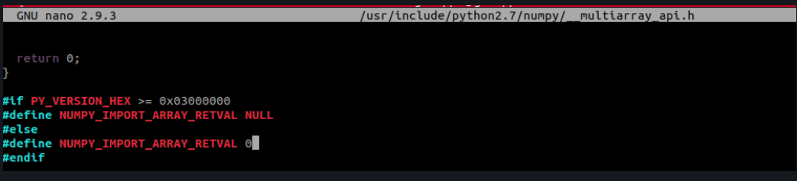

# object_detection-
Repo for object detection/localization in ROS with Intel Realsense camera


# Setup 

## Requirements 

### 1) Install ROS melodic 
- Follow the guide [here](http://wiki.ros.org/melodic/Installation/Ubuntu) to install ROS melodic 
- paste this into the terminal to install catkin build tools : 

```console 
sudo apt-get install python-catkin-tools
```

### 2) Install Torch (used to run neural network inference) 

- Go to the Nvidia Website [here](https://forums.developer.nvidia.com/t/pytorch-for-jetson-version-1-8-0-now-available/72048) and 
download the ```PyTorch v1.8.0``` .whl file 
- extract the folder in the home directory and rename it to ```torch``` (so the compiler can find it) 
- after that the torch folder will be in your home directory (see below) 


## Install 


## Potential Issues Fix : 
- If you run into an issue regarding boost (python_boost) or opencv follow these steps : 
1) install OpenCv3 version (paste into terminal) :
```console 
sudo apt install libopencv-dev=3.2.0+dfsg-4ubuntu0.1
```
2) Change the files according to the post below : 



